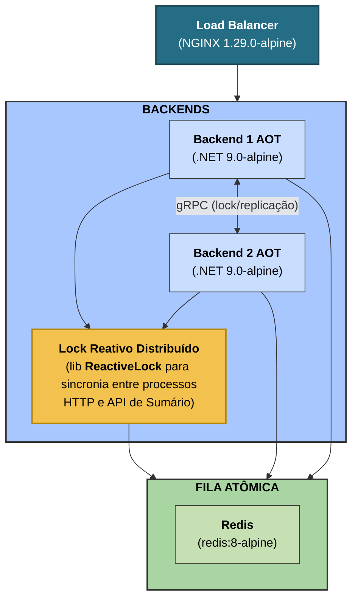

# Rinha de Backend 2025 - API em .NET 9 com AOT

API de pagamentos desenvolvida para o desafio [Rinha de Backend 2025](https://github.com/zanfranceschi/rinha-de-backend-2025), com foco em performance extrema, inicialização instantânea e concorrência eficiente. A aplicação é construída com .NET 9 em modo AOT (Ahead-of-Time), garantindo uso mínimo de recursos e latência reduzida.

#### Minha outra versão com PostgreSQL:
https://github.com/micheloliveira-com/rinha-de-backend-2025-dotnet-csharp-postgres
##### Leia no meu blog os insights da versão em Postgres:
http://micheloliveira.com/blog/desafio-performance-rinha-backend-2025-insights-csharp-postgresql-redis/

*PS: Nem todas as implementações feitas neste projeto são recomendadas para cenários reais de produção e algumas delas foram desenvolvidas especificamente para o desafio Rinha de Backend 2025.*

## Execução local:
```json
{
  "participante": "anonymous",
  "total_liquido": 367104.852,
  "total_bruto": 333126,
  "total_taxas": 16656.3,
  "descricao": "'total_liquido' é sua pontuação final. Equivale ao seu lucro. Fórmula: total_liquido + (total_liquido * p99.bonus) - (total_liquido * multa.porcentagem)",
  "p99": {
    "valor": "3.21ms",
    "bonus": "16%",
    "max_requests": "550",
    "descricao": "Fórmula para o bônus: max((11 - p99.valor) * 0.02, 0)"
  },
  "multa": {
    "porcentagem": 0,
    "total": 0,
    "composicao": {
      "num_inconsistencias": 0,
      "descricao": "Se 'num_inconsistencias' > 0, há multa de 35%."
    }
  }
}
```

## Stack

- **.NET 9 (AOT)** - Gerando um executável nativo
- **[ReactiveLock](https://www.nuget.org/packages/ReactiveLock.Distributed.Grpc/)** - Lock distribuído e reativo via Grpc para garantir consistência entre instâncias
- **Redis** - Enfileiramento atômico de mensagens
- **Grpc** - Sincronização full duplex dos pagamentos entre as instâncias
- **Dapper + Dapper.AOT** - ORM leve, ainda presente, mas utilizado apenas se necessário para lógica interna
- **Polly** - Política de retry resiliente para conexões Redis e Grpc
- **Nginx** - Proxy reverso para balanceamento de carga entre as instâncias
- **Docker Compose** - 1.5 CPU e 350MB de RAM no total, conforme as regras da [Rinha de Backend 2025](https://github.com/zanfranceschi/rinha-de-backend-2025)



## Endpoints

- `POST /payments` - Enfileira um pagamento no Redis para processamento assíncrono
- `GET /payments-summary` - Retorna um resumo agregado diretamente dos dados da memória sincronizados via Grpc
- `POST /purge-payments` - Remove os registros de pagamento da fila da memória

---

## Especificações arquiteturais

- Toda a persistência é realizada em memória e sincronizada via Grpc. Não há dependência de banco de dados relacional.
- O lock distribuído via [ReactiveLock](https://www.nuget.org/packages/ReactiveLock.Distributed.Grpc/) garante consistência entre múltiplas instâncias e sincronia no fluxo entre API e leitura do sumário via Grpc.
- O endpoint de sumário (`GET /payments-summary`) sincroniza o estado dos dados em memória via Grpc entre as instâncias, assegurando leitura consistente sem uso de banco SQL.
- Totalmente compatível com build AOT, sem uso de reflection dinâmica, Linq Expressions ou outros recursos não suportados.

## Como rodar

### Subir a stack com Docker Compose
#### 0. Instale o docker caso não tenha:

[Instruções aqui](https://docs.docker.com/get-started/get-docker/)

#### 1. Compile a aplicação em AOT e suba Redis e NGINX para uso local:
```bash
cd src
docker compose build --no-cache
docker compose up -d
```

#### 2. Instalar o K6:

[Instruções aqui](https://grafana.com/docs/k6/latest/set-up/install-k6/)

#### 3. Clonar o repositório da [Rinha de Backend 2025](https://github.com/zanfranceschi/rinha-de-backend-2025) e subir a api de teste:
```bash
cd payment-processor
docker compose up -d
```

#### 4. Executar o teste com o K6:
```bash
cd rinha-test
k6 run -e MAX_REQUESTS=550 rinha.js
```

Instruções atualizadas do [MINIGUIA - Rinha de Backend 2025](https://github.com/zanfranceschi/rinha-de-backend-2025/blob/main/rinha-test/MINIGUIA.md)

## Licença

MIT © Michel Oliveira

Para sugestões, dúvidas ou contribuições, fique à vontade para abrir uma issue ou pull request.