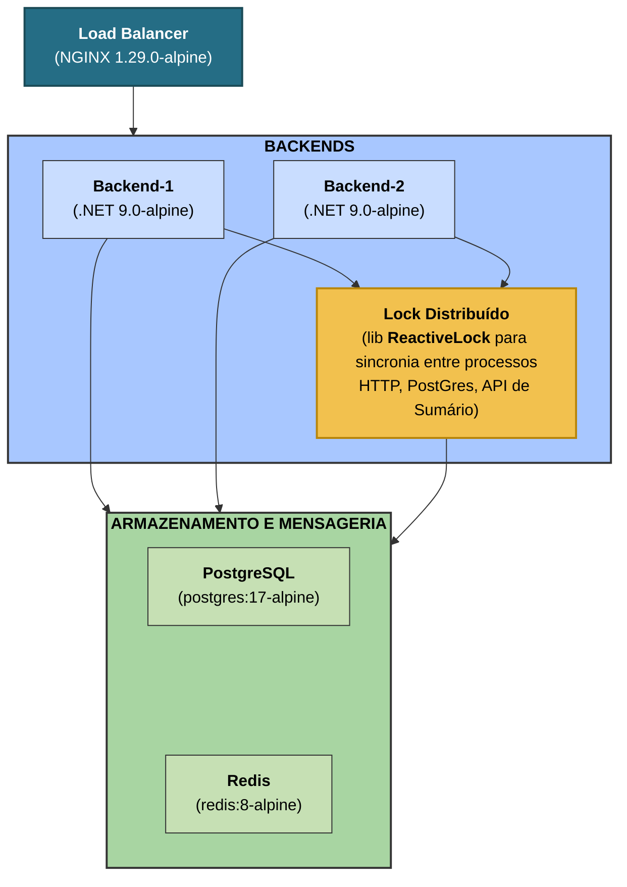

# Rinha de Backend 2025 - API em .NET 9 com AOT

API de pagamentos desenvolvida para o desafio [Rinha de Backend 2025](https://github.com/zanfranceschi/rinha-de-backend-2025), com foco em performance extrema, inicialização instantânea e concorrência eficiente. A aplicação é construída com .NET 9 em modo AOT (Ahead-of-Time), garantindo uso mínimo de recursos e latência reduzida.

PS: Nem todas as implementações feitas neste projeto são recomendadas para cenários reais de produção e algumas delas foram desenvolvidas especificamente para o desafio Rinha de Backend 2025.

## Stack

- **.NET 9 (AOT)** - Gerando um executável nativo
- **ReactiveLock** - Lock distribuído e reativo via Redis para maximinizar a consistência entre as instâncias
- **PostgreSQL e Redis** - Persistência e enfileiramento de mensagens
- **Dapper + Dapper.AOT** - ORM leve e compatível com AOT
- **Polly** - Política de retry resiliente para conexões externas
- **Nginx** - Proxy reverso para balanceamento de carga entre as duas instâncias



## Endpoints

- `POST /payments` - Enfileira um pagamento para processamento assíncrono
- `GET /payments-summary` - Retorna um resumo agregado dos pagamentos
- `POST /purge-payments` - Remove os registros de pagamento do sistema

---

## Especificações arquiteturais

- Uso da biblioteca `ReactiveLock` garante consistência máxima entre múltiplas instâncias sem perda de integridade. Esse, por sua vez, também reage e controla o estado de processamento das requisições HTTP, PostgreSQL e API de sumário entre as instâncias.
- Utiliza inserção em lote (bulk insert) de 100 registros no `PostgreSQL` para otimizar a performance com consistência sincronizada entre as instâncias.
- O lock coordenado ocorre especialmente quando a chamada ao endpoint de `GET /payments-summary` é realizada, sincronizando o flush dos lotes do postgres para manter a integridade dos dados antes de realizar a query no banco de dados.
- O `Redis` utilizado para enfileirar as mensagens recebidas garante um pool consistente e balanceado de workers, diferente do envio das requisições para uma única instância via round robin, que não assegura balanceamento adequado devido à variabilidade no tempo de execução entre as requisições a api de pagamentos.
- Totalmente compatível com build AOT, sem reflection dinâmica nem expressões incompatíveis.
- Pronto para ambientes de alta concorrência, ideal para benchmarks e cenários de stress.

## Como rodar

### Subir a stack com Docker Compose
Esse comando irá compilar a aplicação em AOT e subir Redis, PostgreSQL e NGINX para uso local.
```bash
cd src
docker compose build --no-cache
docker compose up -d
```

## Licença

MIT © Michel Oliveira

Para sugestões, dúvidas ou contribuições, fique à vontade para abrir uma issue ou pull request.
